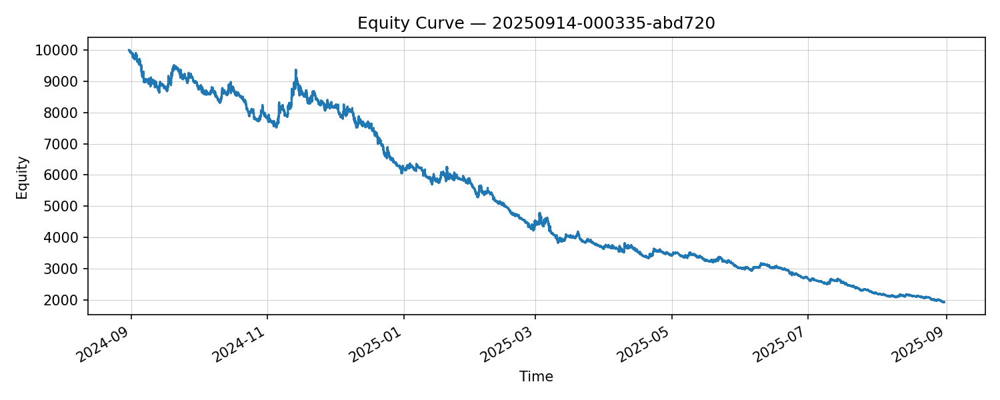
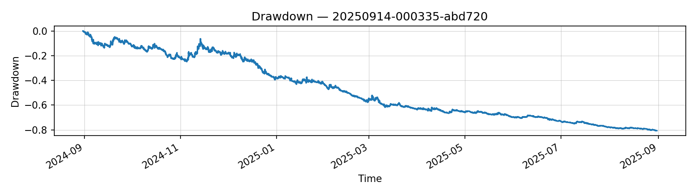

# v0.1 Baseline Report — BTCUSDT(5m)

## 1) 개요
- SMA 크로스(20/60)로 최근 1년 구간 백테스트.
- 비용 모델: 수수료 5bps, 슬리피지 4bps(왕복 18bps).

## 2) 결과 요약
- **PnL -80.68%**, **Sharpe -4.90**, **MDD -80.69%**, **Trades 1053**  
- 해석: 5m 단기 크로스 long-only는 턴오버가 과하고 비용 누적으로 손실이 확대.

## 3) 에쿼티 & 드로다운

## 4) 메모
- 원시 알파 검증: 비용 0 메타모픽 테스트 필요.
- v0.2에서 **밴드(ε)/쿨다운/min_hold** 및 **비용 분해(턴오버/fee/slip)** 도입.
